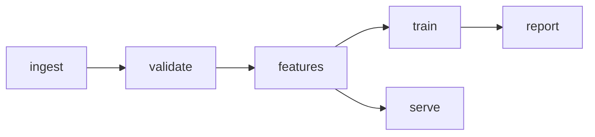

# {{PROJECT_NAME}} — System Design

> Modules and their contracts. The loop designs features *within* these
> boundaries; changing a boundary is a genesis-level decision (new ADR).
>
> Written in Simplified Technical English (ASD-STE100 register). Module
> names match the PRD Terms table exactly.

## Module table

| Module | Responsibility | Inputs | Outputs | Depends on |
|--------|----------------|--------|---------|------------|
| {{name}} | {{one clear purpose}} | {{exact types/shapes}} | {{exact types/shapes}} | {{modules}} |

## Data flow

{{A mermaid flowchart. Note where exploration (notebooks) reads from and
what production writes. ASCII arrows are correct only for a single linear
chain; anything that branches or rejoins becomes unreadable as text.}}

{{Schedules and run cadences are a mermaid `gantt` chart in the same
way. Delete either block if the project has no such structure.}}

## Repo layout

{{Where things live: pipeline code vs notebooks/ vs docs/ vs tests/.}}

## Open questions

{{Unresolved items — each should become an ADR or an exploration task.}}
