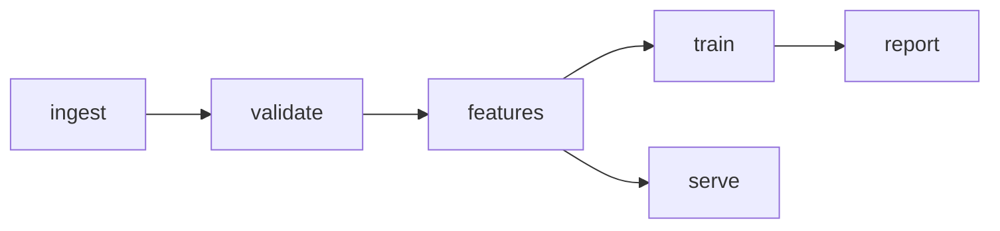

# {{PROJECT_NAME}} — System Design

> Modules and their contracts. The loop designs features *within* these
> boundaries; changing a boundary is a genesis-level decision (new ADR).
> This document says what the system is. The ADRs say why it is that and
> not something else; never restate their reasoning here.
>
> Written in Simplified Technical English (ASD-STE100 register). Module
> names match the PRD Terms table exactly.

{{This design realizes {{grain}}, enforces {{immutability policy}}, and
supports {{downstream consumers}} per `docs/technical-requirements.md`.
Values match the TRD verbatim. Delete this line when no TRD exists.}}

## Module table

| Module | Responsibility | Inputs | Outputs | Depends on | Boundary |
|--------|----------------|--------|---------|------------|----------|
| {{name}} | {{one clear purpose}} | {{exact types/shapes}} | {{exact types/shapes}} | {{modules}} | {{deterministic \| probabilistic}} |

{{The Boundary column decides what can be tested. If a module's output
can be unit tested, it is deterministic. If it depends on domain
judgment, tradeoffs, or incomplete context, it may stay probabilistic.
Every probabilistic module names the output contract that checks it and
what the system does when the contract breaks — a contract that does not
fail closed is not a contract. Delete the column when nothing in the
system is probabilistic.}}

## External interfaces

{{The contract with the outside. The module table above holds the
internal contracts. Flag any endpoint whose latency profile makes a
synchronous call unwise.}}

| Interface | Method | Purpose | Auth | Sync/Async |
|---|---|---|---|---|
| {{name}} | {{verb + path}} | {{what it is for}} | {{scheme}} | {{which}} |

## Data flow

{{A mermaid flowchart. Note where exploration (notebooks) reads from and
what production writes. ASCII arrows are correct only for a single linear
chain; anything that branches or rejoins becomes unreadable as text.}}

{{Schedules and run cadences are a mermaid `gantt` chart in the same
way. Delete either block if the project has no such structure.}}

## Repo layout

{{Where things live: pipeline code vs notebooks/ vs docs/ vs tests/.}}

## AI properties

{{Delete this whole section unless the system has a model, embedding, or
retrieval component. "None" is a recorded decision throughout — a blank
line is a gap. Never state a model name, context window, or price you
cannot ground: mark the assumed figure `[assumed — verify]` and say what
to check.}}

### Memory

| Layer | Decision |
|---|---|
| Within-request context | {{what enters the window, and the eviction rule}} |
| Cross-turn / session | {{store, retention, what is kept and what is summarised}} |
| Long-term / user | {{what persists, and the deletion path}} |
| Caching | {{prompt cache, semantic cache, or none}} |

{{State the privacy consequence of everything that persists.}}

### Evaluation

| Layer | What | Metric | Cadence |
|---|---|---|---|
| Offline | {{golden set}} | {{task-specific metric}} | {{pre-release}} |
| Online | {{production sample}} | {{quality and drift signal}} | {{continuous}} |
| Human | {{review loop}} | {{agreement rate}} | {{scheduled}} |

{{Name the metric specific to this system. "Accuracy" is a failed
section. State the minimum viable golden-set size and who realistically
produces it — evaluation plans die on the second question, not the
first.}}

### Cost

{{Show the arithmetic. A total without its working is not an estimate.}}

1. **Unit assumptions** — {{tokens per request, requests per period,
   $/1M input and output tokens, infrastructure line items. Mark every
   price `[assumed — verify]`.}}
2. **Calculation** — {{the formula, visibly}}
3. **Range** — {{low / expected / high, where the spread reflects volume
   uncertainty, not vendor discounting}}
4. **Dominant driver** — {{the single line item worth optimising first,
   and the one lever that moves it}}

{{Without volume figures, give a cost per 1,000 requests instead of a
total, and raise the volume question in the PRD's open questions. If this
estimate undermines a model decision already recorded, set that ADR's
status to `accepted, under challenge` and name this document.}}

## Risks

{{4-6 rows, ranked by expected cost. At least one is non-technical:
adoption, data access, ownership, or regulatory. The detection signal is
the load-bearing column — a mitigation with no detection signal is a
hope. Where a roadmap gate row checks the risk, name that row as the
signal.}}

| Risk | Likelihood | Impact | Mitigation | Detection signal |
|---|---|---|---|---|
| {{what goes wrong}} | {{low/med/high}} | {{low/med/high}} | {{what reduces it}} | {{what tells you it is happening}} |

## Open questions

{{Unresolved items — each should become an ADR or an exploration task.}}
